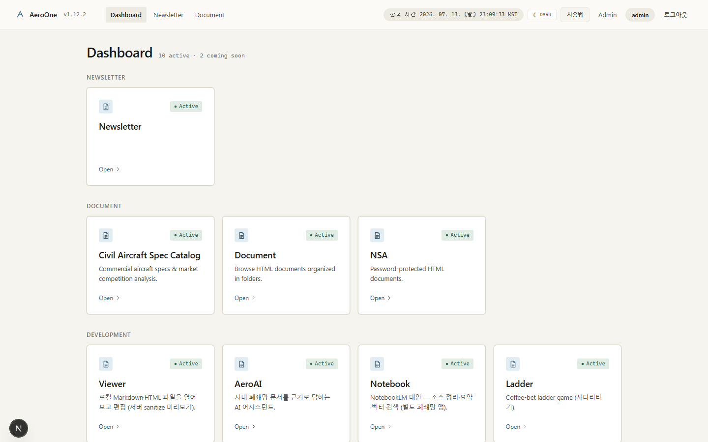
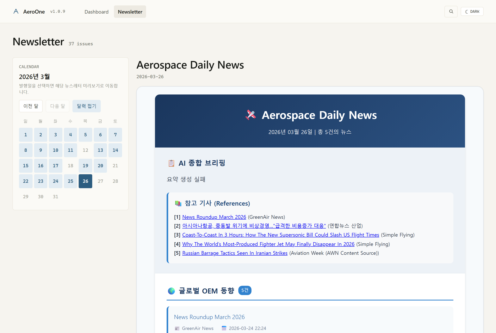
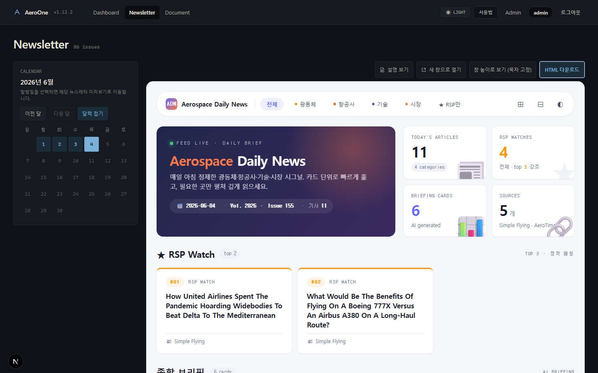

<div align="center">

# AeroOne

**폐쇄망에서도 그대로 돌아가는 사내 뉴스레터·문서 열람 플랫폼**

이미 발행된 HTML / PDF / Markdown 뉴스레터를 한 곳에서 보고, ZIP 하나로 인터넷이 차단된 PC에 동일하게 배포할 수 있는 modular monolith 입니다.


</div>

> [!CAUTION]
> **1.12.2 배포본은 철회되었습니다.** 현재 운영 반입물은 immutable 정식 `1.16.3`이며, `1.16.2`/`1.16.0`/1.15.1/1.15.0/1.14.0/1.13.2/1.13.1/1.13.0은 변경하지 않는 역사 릴리스로 보존합니다(`1.15.0`은 오프라인 설치 차단 결함으로 `1.15.1`로 대체됨). `1.16.3`은 `1.16.2` 위에 Civil Aircraft 대시보드 렌더링 깨짐 수정, 발급된 로그인 계정의 전체(개발중 섹션 포함) 대시보드 접근, start_offline 게이트 무한대기(exit 98) 개선·`stop_offline.bat` 추가, 헤더 버전 표기 정합을 얹은 forward-only 교정판입니다. `1.16.2`는 `1.16.0` 위에 폐쇄망 실사용 결함 4건(bcrypt `__about__` traceback, start_offline 게이트 무음 종료, Leantime 스택 `tlocal` 오파싱, Civil 포털 문구)을 바로잡은 교정판입니다. `1.16.0`은 1.15.1 위에 대시보드 섹션 재편(AI/ETC), Civil Aircraft v1.7 인터랙티브 대시보드, Leantime 실기동 포터블 반입물(별도 ZIP), 버전 표기 정합을 얹은 forward-only feature 릴리스입니다. 이전 immutable 릴리스의 tag·asset·digest는 변경하지 않습니다. Release publication은 완료되어도 사람이 air-gapped network에 물리적으로 import했다는 의미는 아닙니다.

<table>
  <tr>
    <td align="center"><b>대시보드</b></td>
    <td align="center"><b>뉴스레터 (달력 + HTML 본문)</b></td>
    <td align="center"><b>다크 모드</b></td>
  </tr>
  <tr>
    <td></td>
    <td></td>
    <td></td>
  </tr>
</table>

<sub>디자인 시스템 적용 화면 (<code>[data-theme]</code> 라이트·다크, 시스템 폰트만). README 스크린샷 세 장은 <code>docs/images/</code> 의 <code>dashboard.png</code> · <code>newsletter.png</code> · <code>newsletter-dark.png</code> 이며, <code>scripts/_capture_screenshots.py</code>가 검증된 세 캡처를 한 세트로 게시합니다.</sub>

---

## 목차

- [왜 AeroOne 인가](#왜-aeroone-인가)
- [주요 기능](#주요-기능)
- [빠른 시작 — 온라인 Windows PC](#빠른-시작--온라인-windows-pc)
- [폐쇄망 배포 흐름](#폐쇄망-배포-흐름)
- [기술 스택](#기술-스택)
- [프로젝트 구조](#프로젝트-구조)
- [환경 변수](#환경-변수)
- [개발자용 로컬 실행](#개발자용-로컬-실행)
- [검증](#검증)
- [보안과 운영 권장사항](#보안과-운영-권장사항)
- [문서](#문서)
- [사용 범위와 기여](#사용-범위와-기여)

---

## 왜 AeroOne 인가

- **폐쇄망 우선 설계** — 인터넷이 가능한 PC에서 ZIP 한 개를 만들어 옮기면, 폐쇄망 PC에서 같은 코드·같은 의존성·같은 시드 데이터로 그대로 동작합니다. wheelhouse, `node_modules`, 옵션 인스톨러까지 묶여 있습니다.
- **다중 포맷 통합 뷰어** — `newsletter_YYYYMMDD.html` 과 `Aerospace Daily News_YYYYMMDD.pdf` 처럼 한 이슈가 여러 자산을 가지는 현실 데이터를 그대로 다룹니다. `source_type` 에 따라 sandbox iframe / PDF delivery / Markdown render 로 분기합니다.
- **안전한 기본값** — production 환경에서는 기본 secret 과 admin 비밀번호가 거부되고, setup 시 매번 랜덤 값이 생성됩니다. 정적 노출 범위는 `storage/thumbnails` 하위로 한정하고, `_debug.html` 은 import 와 공개 목록에서 모두 제외됩니다.
- **확장 가능한 구조** — 뉴스레터 외 document publishing, AeroAI, Open Notebook, admin tools 를 modular monolith 안에서 점진적으로 붙입니다. 1.8.0 부터 대시보드 카드와 운영 변경은 `service_modules` DB 와 관리자 콘솔에서 관리합니다.

---

## 주요 기능

| 영역 | 내용 |
|---|---|
| 사용자 화면 | 대시보드 모듈 카드(뉴스레터·민간항공기 보고서·문서 보관소 등), 뉴스레터 리딩 뷰(최신·선택 이슈 HTML 직접 렌더), 기본 펼친 달력으로 이슈 전환, 민간항공기 규격 카탈로그(/reports/civil-aircraft, 달력 없음), 문서 보관소(/documents, `_database/document` HTML 을 폴더 트리로 열람), `[data-theme]` 라이트·다크 테마 토글 |
| AeroAI 어시스턴트 (1.7+) | 대시보드 개발중 섹션의 `/ai` — 사내 폐쇄망 문서(Document/Civil/NSA)를 **근거로 답하는** RAG 챗. 대화 영속화·인용(citation) 근거연결·3분할 워크스페이스·프롬프트 프리셋. 답변은 안전한 Markdown 으로 렌더링하고 복사는 원문 텍스트를 유지합니다. HTML 본문 검색 결과는 새 탭으로 열립니다. backend-only Ollama(`gemma4:12b`), same-origin 프록시, reasoning-only 빈 응답 1회 재시도. 1.8.0 부터 운영 로그는 metadata-only 로 저장하며 prompt/answer/snippet 원문은 기록하지 않습니다. |
| Open Notebook 동거 배포 (1.5+) | NotebookLM 대안(MIT)을 **코드 병합 없이 나란히(co-deploy)** — 대시보드 개발중 섹션의 Notebook 카드 → `:8502`. 분리 번들(airgap) + 공유 Ollama + 무인 자동 프로비저닝(모델 자동등록). `run_all.bat` 는 ON API/Frontend/runtime config readiness 확인 후 READY 표시. 상세: [`docs/runbook/closed-network-install-manual.md`](docs/runbook/closed-network-install-manual.md) |
| OpenWebUI 예약 런처 (1.14+) | 대시보드의 OpenWebUI 카드는 **활성 로그인 admin/user 세션 전원**에게 노출되고(anonymous/pending 제외) 현재 브라우저 host 의 `:8080` 새 탭으로만 연결합니다. Open Notebook 과 마찬가지로 별도 프로세스로 기동·인증되며, AeroOne 은 SSO·기동·헬스체크를 제공하지 않습니다. 상세: [`docs/CLOSED_NETWORK_GUIDE.md`](docs/CLOSED_NETWORK_GUIDE.md) §19 |
| AI 프로바이더 — Ollama 병행 (1.14+, 관리자) | `/admin` 콘솔에서 Ollama 와 별도로 OpenAI-호환 프로바이더(Base URL/모델/API 키)를 구성할 수 있습니다. 후보 테스트(무저장) → 저장 → 영속 테스트 `ok` → Activate 순서를 강제하며, 선택은 명시 전환만 가능하고 자동 폴백이 없습니다. API 키는 write-only 이며 Windows DPAPI 로만 암호화 보관되어 DB·백업·로그·문서 어디에도 평문으로 남지 않습니다. 상세: [`docs/CLOSED_NETWORK_GUIDE.md`](docs/CLOSED_NETWORK_GUIDE.md) §19 |
| 콘텐츠 분기 | HTML(sandbox iframe + sanitize + CSP), PDF(direct delivery), Markdown(서버 렌더) |
| 관리자 화면 (1.8+) | 로그인 후 `/admin` 홈 콘솔에서 버전/모드, DB, 최신 뉴스레터, 자산 상태, 읽음 요약, AI 상태, 최근 감사, 사용자/RBAC, 대시보드 모듈, 백업 상태를 확인합니다. 뉴스레터 목록은 검색/상태 필터/일괄 게시·보관/자산 점검을 지원합니다. |
| 인증/권한 | signed HttpOnly session cookie + SameSite=Lax + CSRF 토큰. 서버 권한은 `admin/user/pending` 역할과 additive permissions/groups/resource grants 로 판단하며, 관리자 mutation 은 permission + CSRF + same-transaction audit 를 통과해야 합니다. |
| 데이터 모델 | `users / groups / user_permissions / group_permissions / resource_grants / admin_audit_events / service_modules / backup_records / categories / tags / newsletters / newsletter_tags / newsletter_assets / ai_request_logs` |
| 운영 모드 | `development` / `test` / `closed_network` / `production` 4 모드. `closed_network` 는 HTTP 폐쇄망에서 secret 강도 검증을 강제하면서 secure cookie 는 끔 |
| 기본 LAN / loopback | 1.0.22+ 기본은 LAN(`0.0.0.0`, 이 PC 의 LAN IP 자동 감지) — backend·frontend·CORS·NEXT_PUBLIC_API·자동 오픈 URL 5자리 일괄 적용. 이 PC 전용은 `--local`, 호스트 고정은 `--allow-host=<IP>` |
| 검증 | `1.16.3`은 Civil Aircraft 앱 라우트를 `app/index.html` 진입으로 고정해 프록시 상대경로 깨짐을 수정했고(백엔드 `/app`·`/app/index.html`·`/app/assets/**` **200**, `/civil-aircraft/assets/**` 404 실측), 발급된 로그인 계정이 개발중 섹션 카드까지 접근하도록 정책을 넓히면서 NSA는 접근제어를 유지합니다(backend RBAC/NSA 회귀 **73 passed** + 신규 가드, frontend civil-aircraft/version **12 passed**, batch **43 passed**). start_offline 은 이미 실행 중이면 즉시 안내하고 게이트 대기를 20초로 줄였으며 `stop_offline.bat` 으로 잔여 백엔드/게이트 홀더를 정리합니다. `1.16.2`는 폐쇄망 실사용 결함 4건을 재현·수정해 bcrypt==4.0.1 clean-load(auth **29 passed**)·게이트 폴백(batch/gate)·Leantime CRLF·Civil 앱 라우트(reports **5 passed**)를 검증했습니다. `1.16.0`은 frontend 전체 vitest **88 files green**, `tsc --noEmit`, Next 15.5.18 production build를 통과했고 backend 변경 영역이 green(기반 `1.15.1` = backend **775 passed**)입니다. 1.15.x/1.14.0/1.13.x의 역사적 검증 사실은 그대로 보존합니다. |
| 배포 | Docker Compose (개발), Windows 배치 스크립트 (운영/폐쇄망) |
| 폐쇄망 오픈소스 도입 | 검증된 vendoring·airgap 번들·자동 프로비저닝 프로세스로 외부 오픈소스를 폐쇄망에 도입 — 재사용 플레이북: [`docs/closed-network-oss-adoption-process.md`](docs/closed-network-oss-adoption-process.md) |

---

## 빠른 시작 — 온라인 Windows PC

```cmd
:: 1) 초기 설치 (가상환경, 의존성, DB, 시드, frontend npm install)
setup.bat

:: 2) 백엔드/프런트 실행 + 브라우저 자동 오픈
start.bat
```

| 화면 | URL |
|---|---|
| 공개 목록 | http://localhost:29501/newsletters |
| 관리자 로그인 | http://localhost:29501/login |
| 헬스체크 | http://localhost:18437/api/v1/health |

`setup.bat`은 새 작업공간의 환경 파일과 초기 시드 관리자용 랜덤 비밀번호를 생성합니다. 기존 DB가 있으면 환경 파일만 다시 만들어질 수 있으며 DB에 저장된 관리자 비밀번호 해시는 자동 교체되지 않습니다. 설치 직후에는 `backend/.env`의 `ADMIN_USERNAME` / `ADMIN_PASSWORD`를 확인하고, 기존 DB의 자격 노출 대응은 [자격 증명 회전 런북](docs/runbook/credential-rotation.md)을 따르세요.

관리자 계정의 `ADMIN_USERNAME` / `ADMIN_PASSWORD` 는 `setup.bat` 이 생성하는 **최초 bootstrap 자격 증명**입니다. 설치 직후 `backend/.env` 에서 확인해 `/login` 으로 로그인한 뒤, `/admin` 의 **관리자 계정 / 비밀번호**에서 현재 비밀번호를 확인하고 새 비밀번호(8자 이상)로 바꾸세요. 이후 실제 비밀번호는 DB의 사용자 계정에 저장되므로 `.env` 값을 바꿔도 기존 계정 비밀번호는 바뀌지 않습니다.

추가 옵션:

```cmd
setup.bat --dry-run     :: 실제 설치 없이 단계만 출력
setup.bat --no-pause    :: 완료 후 창을 멈추지 않음
```

---

## 폐쇄망 배포 흐름

```
[온라인 PC]                                      [폐쇄망 PC]
 setup.bat                                       ─┐
 start.bat (선택, 동작 검증)                       │
 offline_package.bat ─ AeroOne ZIP ───────────►  setup_offline.bat
 open-notebook\airgap\1-online-package.bat ───►  AeroOne-bundle\2-airgap-install.bat
 Ollama 모델 blob(gemma4:12b, nomic-embed-text) ►  %USERPROFILE%\.ollama\models
                                                 scripts\run_all.bat
```

### 릴리즈 1.16.2 반입 파일

현재 최신 운영 반입물은 2026-07-15 게시된 immutable 정식 `1.16.2` Release의 `AeroOne-offline-1.16.2.zip`(+`.sha256`)이며, Leantime 실기동을 위한 **선택 반입물** `AeroOne-Leantime-Stack-v3.9.8-20260715-193631.zip`(+`.sha256`)이 같은 Release에 함께 게시됩니다. published 시각은 `2026-07-15T11:04:15Z`입니다. 이 릴리스는 PR #32 no-ff merge commit `a39b724e6926370021ce2f8dd42d201b6914f8d6` 위의 버전 표기 커밋 `5191bf37a830ac99a9d5a45e0ea1f40b6eaffa6f`에서 annotated tag object `b4e39308b70dc59899af07eea394dd500dab8137`로 게시되었습니다(동일 내용을 `1.16.1`로 게시하려다 immutable 정책으로 태그가 소각되어 `1.16.2`로 승격). 본체 ZIP size는 `235547463` bytes, SHA-256은 `60e1124d7343b30728a294938918b246fa85000b338142b1a893eab51430460c`이고, Leantime 스택 ZIP size는 `251460171` bytes, SHA-256은 `9eebf1851d60183ae48b786145ab525c4b49cd4ad6bffa0e4cdc12a3f7c58f65`입니다. GitHub immutable releases 정책은 활성화되어 있으며, `1.16.0`(ZIP SHA-256 `b44d11b02327663c7af787a45197a25908c91545f182d6d8a87ca7d16b5ccf7f`), `1.15.1`(`1e2a3ebb10d9c4a57943604e810fef7432065ac7965df41f9f4a2cf1fd153f98`), `1.15.0`(`8fb46dc00f0ae16bebaebee44dd8bae64656e9527eda7b9fadf1c8bc90dcafd5`, 설치 차단으로 `1.15.1`로 대체), `1.14.0`(`f6fae644413b67449c6cefdf4a32e9d570416199a124b5c4de0eceadaa25a8f7`), `1.13.2`(`92d5178d6fb67573a1f0b36e0a744e00b4b559548081b463d45a4ba1d669d8a4`), `1.13.1`(`b05445b53ecca02175afcd016ac0e896163010e1a06a0b996b8ebe79a798e290`), `1.13.0`은 tag·asset·digest를 변경하지 않는 역사 릴리스로 그대로 보존합니다. Leantime 스택은 AGPL(Leantime)/GPL(MariaDB) 바이너리를 본체 ZIP과 분리 격리한 선택 반입물입니다. Release publication은 사람이 air-gapped network에 물리적으로 import했다는 뜻이 아니며, 로컬 중간 ZIP은 운영 배포본이 아닙니다.

| 파일 | 어디서 받는가 | 폐쇄망에서 놓을 위치 | 역할 |
|---|---|---|---|
| `AeroOne-offline-1.16.2.zip` + `.sha256` | [정식 immutable GitHub Release `1.16.2`](https://github.com/Py-CI-Park/AeroOne/releases/tag/1.16.2) asset (ZIP size `235547463` bytes, SHA-256 `60e1124d7343b30728a294938918b246fa85000b338142b1a893eab51430460c`) | `D:\AeroOne\` 로 압축 해제 | allow-list로 검증된 AeroOne 소스, production wheelhouse/node_modules, prebuilt `.next`, 정확한 Python 3.12.7 / Node 20.18.0 인스톨러 |
| `AeroOne-Leantime-Stack-v3.9.8-20260715-193631.zip` + `.sha256` (선택) | 같은 `1.16.2` Release asset (ZIP size `251460171` bytes, SHA-256 `9eebf1851d60183ae48b786145ab525c4b49cd4ad6bffa0e4cdc12a3f7c58f65`) | `D:\AeroOne-Leantime-Stack\` 로 압축 해제 | 포터블 PHP 8.3.32 + MariaDB 11.4.8 + Leantime v3.9.8 + CRLF 정규화된 setup/start/stop (폐쇄망 실기동, `tlocal` 교정판, AGPL/GPL 격리) |
| `AeroOne-bundle.zip` | 같은 Release asset 또는 Open Notebook 저장소 `dist\` | `D:\AeroOne-bundle\` 로 압축 해제 | Open Notebook 별도 앱(Frontend 8502, API 5055, SurrealDB 8000), 자체 Python/Node/uv/ffmpeg/SurrealDB 포함 |
| `%USERPROFILE%\.ollama\models\manifests`, `blobs` | 인터넷 PC 에서 `ollama pull gemma4:12b`, `ollama pull nomic-embed-text` 후 복사 | 폐쇄망 PC 같은 경로 | AeroAI/Open Notebook 공용 LLM·임베딩 모델 |
| `OllamaSetup.exe` | Ollama 공식 설치 파일 | 폐쇄망 PC에서 1회 설치 | `127.0.0.1:11434` 로 두 앱이 공유하는 모델 서버 |

1. **온라인 PC**

   ```cmd
   setup.bat
   start.bat            :: 동작 확인 후 닫기
   offline_package.bat  :: exact 1.13.2 tag에서 dist\AeroOne-offline-1.13.2.zip 생성
   ```

   ZIP 안에 들어가는 것:

   - tracked top-level allow-list를 통과한 저장소 소스 (`.git`, `.gjc`, `.omo`, `.env`, DB/storage, vendor, artifacts, 개발 산출물 제외)
   - clean `npm ci`/build/prune로 생성한 production `frontend/node_modules`와 prebuilt `.next` (`cache` 제외)
   - `backend/requirements.txt` 전용 Python wheelhouse (`offline_assets/python-wheels/`)
   - 정책에 SHA-256·Authenticode 정보가 고정된 `python-3.12.7-amd64.exe`, `node-v20.18.0-x64.msi`
   - 운영 콘텐츠 `_database/*`는 공개 ZIP에 포함하지 않으며 별도 승인된 내부 반입 경로로 전달

2. **폐쇄망 PC**

   - 권장 압축 해제 위치: `D:\AeroOne\` 또는 `C:\Programs\AeroOne\` 등 **사용자 쓰기 권한이 있는 절대 경로** (`Program Files` 같은 권한 제한 폴더 / 한글 경로 / 공백 경로 회피)
   - `Python 3.12` 와 `Node.js LTS` 가 PC에 없으면 ZIP 안 `offline_assets\installers\` 의 설치 파일을 먼저 실행

   **기본 = LAN (1.0.22+)** — 옵션 없이 실행하면 이 PC 의 LAN IPv4 를 자동 감지해 `0.0.0.0` 으로 띄웁니다. 같은 PC 와 LAN 의 다른 PC 모두 `http://<IP>:29501/` 로 접속 가능 (LAN IPv4 미감지 시 localhost 로 폴백).

   ```cmd
   setup_offline.bat    :: 사전 점검 + .env 재작성 + 가상환경 + 오프라인 pip install + DB + build (기본 LAN)
   start_offline.bat    :: 백엔드/프런트 실행 + 브라우저 자동 오픈 (기본 LAN, 0.0.0.0 바인딩)
   ```

   **이 PC 에서만 (`--local`)** — LAN 노출 없이 localhost 전용

   ```cmd
   setup_offline.bat --local
   start_offline.bat --local    :: 모두 127.0.0.1 바인딩
   ```

   **특정 IP 고정 (`--allow-host=<IP>`)** — 자동 감지가 틀리거나 호스트를 명시하고 싶을 때

   ```cmd
   setup_offline.bat --allow-host=192.168.1.10
   start_offline.bat --allow-host=192.168.1.10
   ```

   환경 변수 `AEROONE_ALLOW_HOST` 도 동일하게 받습니다(`auto` 도 가능). **1.0.22+ 부터 기본이 LAN** 이므로 옵션 없이 실행해도 IP 로 접속됩니다 — 명시 IP 고정이 필요할 때만 `--allow-host=<IP>` 를 쓰세요. LAN 으로 접속할 땐 자기 PC 도 `http://<IP>:29501/` 로 들어가야 쿠키 격리를 피할 수 있습니다(`start_offline.bat` 가 자동 오픈하는 URL 을 그대로 사용). **LAN 의 다른 PC** 에서 접속하려면 이 PC 에서 `scripts\allow_lan_firewall.cmd` 를 관리자 권한으로 한 번 실행해 방화벽 인바운드(`18437`/`29501`, 로컬 서브넷 한정)를 허용하세요 (`--remove` 로 원복). 인터넷 노출 차단을 위해 두 포트의 LAN 외부 차단 규칙도 함께 두세요. LAN 노출 없이 이 PC 에서만 쓰려면 `--local`.

   `setup_offline.bat`는 폐쇄망 PC에서 `APP_ENV=closed_network`로 부팅하고 환경 파일의 `JWT_SECRET_KEY`와 초기 시드용 `ADMIN_PASSWORD`를 새 랜덤 값으로 생성합니다(기존 `.env`는 `.bak`로 자동 백업). 기존 DB의 사용자 비밀번호 해시·세션은 setup 재실행만으로 회전되지 않습니다. `closed_network` 모드는 HTTP 폐쇄망에서 secure cookie는 끄고 secret 강도 검증은 켜는 전용 모드입니다. 신규 설치 직후 `backend\.env`의 `ADMIN_PASSWORD`를 확인하고, 기존 DB의 노출 사고에는 회전 런북을 사용하세요.

   이 `ADMIN_PASSWORD` 는 최초 관리자 계정을 만드는 bootstrap 값이지, 이미 DB에 있는 계정의 비밀번호 회전 수단이 아닙니다. 설치 직후 `backend\.env` 의 값을 이용해 로그인한 뒤 `/admin` 의 **관리자 계정 / 비밀번호**에서 즉시 변경하세요. `.env` 와 `.env.bak` 에는 비밀이 남으므로 접근을 제한하고, rollback 보존 기간이 끝난 `.env.bak` 는 안전하게 삭제하세요.

3. **신규 뉴스레터 추가 (운영 PC에서 반복 작업)**

   - `_database\newsletter\` 폴더에 새 HTML / PDF 파일을 추가 (파일명: `newsletter_YYYYMMDD.html`)
   - **별도 조작 없이** `/newsletters` 페이지를 새로고침하면 새 발행호가 자동 반영됩니다 (서버 재시작 불필요). 공개 읽기 요청이 들어올 때 폴더 변경(파일명·크기·수정시각)을 감지해 DB 를 자동 동기화합니다.
   - 관리자 페이지 (`/login` 로그인 → `/admin/newsletters`) 의 **Import / Sync** 버튼은 즉시 강제 동기화하는 수동 폴백으로 남아 있습니다.

4. **백업 (정기 작업)**

   - DB: `backend\data\aeroone.db` 한 파일 복사
   - 사용자 콘텐츠: `storage\markdown\` 와 `storage\thumbnails\` 폴더 백업
   - 원본: `_database\newsletter\` 폴더 백업
   - 위 세 경로만 보관하면 동일 PC 또는 다른 폐쇄망 PC에서 복원 가능합니다.

- 종합 가이드 (사람·AI 모두 위한 단일 진입점, 9단계 진행 체크리스트 포함): [`docs/CLOSED_NETWORK_GUIDE.md`](docs/CLOSED_NETWORK_GUIDE.md)
- 자세한 절차·FAQ·트러블슈팅: [`docs/runbook/windows-offline.md`](docs/runbook/windows-offline.md)

---

## 기술 스택

| 계층 | 사용 기술 |
|---|---|
| Frontend | Next.js (App Router), TypeScript, Tailwind CSS |
| Backend | FastAPI, Pydantic, SQLAlchemy 2.x, Alembic |
| Auth | signed HttpOnly session cookie, CSRF 토큰 |
| Data | SQLite (운영 시작점) → PostgreSQL 전환 가능 |
| Storage | 로컬 파일시스템 + `StorageService` 추상화 (MinIO/S3 전환 여지) |
| Test | pytest, pytest-asyncio, httpx / Vitest, Testing Library |
| Infra | Docker Compose, Windows 배치 스크립트 |

---

## 프로젝트 구조

```
AeroOne/
├─ backend/              FastAPI 앱, Alembic 마이그레이션, 시드 스크립트
├─ frontend/             Next.js 앱
├─ _database/newsletter/ 뉴스레터 HTML/PDF 원본 (newsletter_YYYYMMDD.html 형식, import root)
├─ _database/civil_aircraft/ 민간항공기 규격 정적 HTML 보고서
├─ _database/document/   문서 보관소 HTML (하위 폴더로 분류 가능, /documents 에서 폴더 트리로 열람)
├─ storage/              Markdown / 썸네일 / 첨부 (앱 관리)
├─ docs/                 개발 계획, 런북, 설계 문서
├─ infra/                Dockerfile / compose 자원
├─ scripts/              런처 보조 스크립트 (브라우저 오픈 등)
├─ setup.bat             온라인 PC 초기 설치
├─ start.bat             온라인 PC 실행
├─ offline_package.bat   폐쇄망용 ZIP 패키지 생성
├─ setup_offline.bat     폐쇄망 PC 초기 설치
├─ start_offline.bat     폐쇄망 PC 실행
└─ docker-compose.yml    개발용 컨테이너 실행
```

---

## 환경 변수

기본값과 의미만 발췌했습니다. 전체 키는 [`.env.example`](.env.example) 참고.

| 키 | 의미 | 기본값 / 비고 |
|---|---|---|
| `APP_ENV` | 실행 모드 | `development` (`setup.bat`) / `test` / `closed_network` (`setup_offline.bat`) / `production`. `closed_network` 와 `production` 은 기본 secret 거부 |
| `BACKEND_PORT` / `FRONTEND_PORT` | 서비스 포트 | `18437` / `29501` |
| `DATABASE_URL` | DB 연결 문자열 | SQLite 기본, PostgreSQL 가능 |
| `JWT_SECRET_KEY` | 세션 서명 키 | setup이 환경 파일에 랜덤 생성(64자 hex). 기존 DB의 세션·사용자 자격 전체 회전을 뜻하지 않음 |
| `ADMIN_USERNAME` / `ADMIN_PASSWORD` | 단일 시드 관리자 | setup이 새 환경/초기 시드용 비밀번호를 랜덤 생성(48자 hex). 최초 계정 생성/legacy bootstrap에만 쓰며, 기존 DB 해시나 운영 중인 계정 비밀번호는 별도 회전 필요 |
| `ADMIN_SESSION_COOKIE_NAME` | 관리자 세션 쿠키 이름 | `admin_session` |
| `CSRF_COOKIE_NAME` | CSRF 토큰 쿠키 이름 | 프런트와 동일 값 사용 |
| `NEWSLETTER_IMPORT_ROOT_HOST` / `_CONTAINER` | 원본 폴더 호스트/컨테이너 경로 | 컨테이너 실행 시 양쪽 사용 |
| `STORAGE_ROOT` | 앱 storage 루트 | 정적 노출은 `thumbnails` 하위만 |
| `CORS_ORIGINS` | 프런트 origin 화이트리스트 | `http://localhost:29501` (LAN 모드면 두 origin) |
| `NEXT_PUBLIC_API_BASE_URL` | 브라우저가 호출할 backend 베이스 | loopback 시 `http://localhost:18437`, LAN 모드 시 `http://<host>:18437` |
| `SERVER_API_BASE_URL` | Next.js SSR 이 호출할 backend 베이스 | 항상 IPv4 loopback (`http://127.0.0.1:18437`) |
| `LAN_HOST` | (옵션) `setup_offline.bat --allow-host` 가 .env 에 남기는 메타 | LAN 모드 운영 중인 호스트 표시용 |
| `AEROONE_ALLOW_HOST` | LAN 모드 호스트 (옵션 인자 대신 환경 변수로 지정) | `setup_offline.bat` / `start_offline.bat` 모두 인식 |
| `AI_FEATURES_ENABLED` | 대시보드 AI 기능 on/off | `true` (`setup.bat` / `setup_offline.bat`) |
| `OLLAMA_BASE_URL` | 백엔드가 호출할 Ollama API | 기본 `http://127.0.0.1:11434`; 다른 폐쇄망 PC면 `http://<ollama-ip>:11434` |
| `OLLAMA_DEFAULT_MODEL` | AI 채팅 기본 모델 | `gemma4:12b` |

---

## 개발자용 로컬 실행

Linux / macOS / WSL:

```bash
cp .env.example .env

cd backend
python3 -m venv .venv
. .venv/bin/activate
pip install -r requirements-dev.txt
alembic upgrade head
PYTHONPATH=. python scripts/seed.py
uvicorn app.main:app --reload --host 0.0.0.0 --port 18437

# 다른 터미널
cd frontend
npm install
npm run dev
```

Docker:

```bash
docker compose up --build
```

`git worktree` 환경에서 `.venv` / `node_modules` / `backend/data` / `_database/newsletter` 가 비어 보이는 케이스 등 운영자 주의사항은 [`docs/runbook/local-dev.md`](docs/runbook/local-dev.md) 에 정리되어 있습니다.

---

## 검증

```bash
# backend
cd backend && . .venv/bin/activate
python -m pytest

# frontend
cd frontend
npm run test
npm run typecheck
npm run build
```

정식 `1.13.0`은 PR #22가 main에 병합된 merge commit `c1cbc01062f0d30a97be0ea3df47973d040d2638`에서 annotated tag `1.13.0`으로 게시되었습니다. backend 전체 **570 passed**, frontend **397 passed / 73 files**, `tsc --noEmit`, `next build`, production Chrome smoke/matrix/Axe/Lighthouse/React 진단과 QA 오프라인 ZIP의 pre-stage/post-ZIP verifier를 확인했습니다. 공식 ZIP SHA-256은 `18038dd056e0d1209cb3b889402f2d84f1dc1a51b10ba653b517b6e65bad56d1`이며, asset은 [GitHub Release 1.13.0](https://github.com/Py-CI-Park/AeroOne/releases/tag/1.13.0)에서 받을 수 있습니다. 이 릴리스는 immutable releases 정책 활성화 전 게시되어 `immutable=false`로 남은 역사 기록이며 tag와 asset을 보존합니다. 모든 자동 증거는 동일 커밋별 `artifacts/qa/v1.13.0/<SHA>/`에 분리되며 운영 `.env`·canonical DB·secure root를 변경하지 않습니다. 1.13.1의 게시 사실과 digest는 위 반입물 절에 기록한 그대로 보존하며, 1.13.2는 package fail-closed behavior와 QA contract seam만 변경하고 제품 feature behavior는 변경하지 않습니다. `1.12.2`의 과거 검증 기록은 철회 배포본의 승인 근거로 재사용하지 않습니다. 회귀 발생 시 [`docs/INDEX.md`](docs/INDEX.md) §7과 [`docs/reports/phase-27-v1-13-0-release-candidate.md`](docs/reports/phase-27-v1-13-0-release-candidate.md)를 기준으로 진단합니다.

---

## 보안과 운영 권장사항

- 운영 모드는 `APP_ENV` 로 4 가지 — `development` (개발자 로컬), `test` (pytest 픽스처), `closed_network` (폐쇄망 HTTP, secret 강도 검증 ON / secure cookie OFF), `production` (인터넷 노출 HTTPS, 둘 다 ON). `closed_network` 와 `production` 은 기본 예제값이나 짧은 secret 을 부팅 시 거부합니다.
- HTTPS 종단을 두면 `production` 에서 `secure cookie` 가 자동 활성화됩니다. HTTP-only 폐쇄망은 `closed_network` 로 둬야 쿠키가 살아 있으면서 검증도 켜집니다.
- **1.0.22+ 기본이 LAN** 이라 backend / frontend 를 `0.0.0.0` 으로 노출합니다(이 PC 의 LAN IP 자동 감지). **반드시 신뢰할 수 있는 폐쇄망 LAN** 안에서만 사용하세요. LAN 노출을 원치 않으면 `--local` 로 localhost 전용 실행이 가능합니다. 다른 PC 접속은 `scripts\allow_lan_firewall.cmd`(관리자, 로컬 서브넷 한정)로 허용하고, Windows 방화벽에서 `18437` / `29501` 두 포트의 LAN **외부** 차단 규칙을 함께 두세요. 인터넷 노출 production 으로 사용 금지.
- `_database/newsletter` 와 `storage/` 는 운영 PC에 한정해 두고, 백업·접근 권한은 사내 정책에 맞춰 분리하세요.
- 관리자 비밀번호 회전은 **로그인한 관리자**가 `/admin` 의 **관리자 계정 / 비밀번호**에서 현재 비밀번호와 새 비밀번호(8자 이상)를 입력해 수행합니다(일상적인 방법). 이 작업은 DB의 `users` 레코드를 갱신하고 다른 세션을 무효화합니다. `setup.bat` / `setup_offline.bat` 재실행이나 `.env` 의 `ADMIN_PASSWORD` 변경은 이미 생성된 계정을 회전하지 않습니다.
- 현재 비밀번호를 잃었거나 노출되어 로그인할 수 없는 비상 상황에는, 권한 있는 별도 관리자가 `/admin` 사용자/RBAC의 **비밀번호 재설정**으로 임시 비밀번호를 발급합니다. 사용할 수 있는 관리자 세션이 전혀 없다면, 자격 증명 노출이 의심되는 경우에는 setup 배치를 재실행하지 말고 서비스를 중지한 뒤 [`scripts\rotate_aeroone_credentials.ps1`](scripts/rotate_aeroone_credentials.ps1)을 실행합니다. 도구도 알려진 AeroOne Windows 서비스와 설정 포트 listener가 남아 있으면 파일·DB 변경 전에 거부합니다. 회전 후 자격은 current Windows SID 전용 [`scripts\view_aeroone_credentials.ps1`](scripts/view_aeroone_credentials.ps1)로 확인하며 기본 마스킹과 30초 clipboard 자동 삭제를 사용합니다. 상세 절차: [`docs/runbook/credential-rotation.md`](docs/runbook/credential-rotation.md). 서비스를 멈추고 활성 `DATABASE_URL` 데이터베이스의 일관된 사본(기본 SQLite는 `backend\data\aeroone.db`, PostgreSQL은 DB 백업)을 먼저 보관한 뒤, 앱의 password hasher로 대상 `users.password_hash` 를 교체하고 `session_version` 및 `password_changed_at` 를 갱신하는 DB 인지형 복구 절차도 가능합니다. 복구 후 로그인과 세션 무효화를 확인하고 관리자 콘솔에 사고 기록을 남깁니다.
- setup이 남긴 `backend\.env.bak` 에는 이전 bootstrap 비밀번호와 secret이 있을 수 있습니다. 활성 `backend\.env` 는 계속 보호하고, rollback 보존 기간이 지나 더 이상 필요하지 않은 `.env.bak` 는 접근 통제된 절차로 삭제하세요.
- 관리자 인증은 `/admin/*` 모든 mutation/sync 엔드포인트의 신뢰 경계입니다. 정책 배경: [`docs/runbook/admin-auth.md`](docs/runbook/admin-auth.md)

---

## 문서

전체 문서 색인은 [`docs/INDEX.md`](docs/INDEX.md) 입니다. 자주 찾는 자리만 추리면 다음과 같습니다.

| 분류 | 위치 |
|---|---|
| 폐쇄망 운영 종합 가이드 | [`docs/CLOSED_NETWORK_GUIDE.md`](docs/CLOSED_NETWORK_GUIDE.md) (19장 + 부록, Open Notebook co-deploy §18, OpenAI-호환 AI 프로바이더 + 예약 런처 §19) |
| **폐쇄망 상세 설치·사용 매뉴얼 (AeroOne + Open Notebook)** | [`docs/runbook/closed-network-install-manual.md`](docs/runbook/closed-network-install-manual.md) |
| Open Notebook 동거 배포 런북 | [`docs/runbook/open-notebook-airgap.md`](docs/runbook/open-notebook-airgap.md) |
| 폐쇄망 오픈소스 도입 프로세스 (재사용 플레이북) | [`docs/closed-network-oss-adoption-process.md`](docs/closed-network-oss-adoption-process.md) |
| 폐쇄망 실행 런북 | [`docs/runbook/windows-offline.md`](docs/runbook/windows-offline.md) (가장 깊은 세부) |
| 폐쇄망 빠른 사용 가이드 (1.16.0, AeroOne+Leantime) | [`docs/runbook/closed-network-usage.md`](docs/runbook/closed-network-usage.md) |
| 로컬 개발 런북 | [`docs/runbook/local-dev.md`](docs/runbook/local-dev.md) |
| 관리자 인증 정책 | [`docs/runbook/admin-auth.md`](docs/runbook/admin-auth.md) |
| 자격 증명 사고 대응 회전 | [`docs/runbook/credential-rotation.md`](docs/runbook/credential-rotation.md) |
| 단계별 변경 보고서 (closed_network / --allow-host / 시뮬레이션 / docstring) | [`docs/reports/INDEX.md`](docs/reports/INDEX.md) |
| 설계 산출물 (plan + spec) | [`docs/superpowers/INDEX.md`](docs/superpowers/INDEX.md) |
| 개발 계획 (MVP) | [`docs/dev_plan/20260327_newsletter_platform_mvp.md`](docs/dev_plan/20260327_newsletter_platform_mvp.md) |
| AI 에이전트 / 협업자 진입점 | [`AGENTS.md`](AGENTS.md), [`CLAUDE.md`](CLAUDE.md), [`CONTRIBUTING.md`](CONTRIBUTING.md) |

---

## 사용 범위와 기여

- AeroOne 은 사내 폐쇄망 운영을 일차 목적으로 하는 운영 소프트웨어입니다. 외부 환경에 그대로 노출하기 전에는 최소한 다음을 점검하세요.
  - `APP_ENV=production` 강제와 secret/비밀번호 정책
  - HTTPS 종단과 `secure cookie` 보장
  - `_database/newsletter` 와 `storage/` 의 접근 권한
  - CORS / 리버스 프록시 / 방화벽 구성
- 커밋 메시지는 한국어 제목 + 한국어 본문 + Lore trailer 규칙을 따릅니다. 자세한 규칙: [`AGENTS.md`](AGENTS.md), [`CLAUDE.md`](CLAUDE.md), [`CONTRIBUTING.md`](CONTRIBUTING.md).
- 라이선스는 [`LICENSE`](LICENSE) (All Rights Reserved) — 사내 사용을 일차 목적으로 합니다. 외부 사용·재배포·라이선스 예외 / 보안 신고는 LICENSE 의 연락처로 직접 연락하세요.
