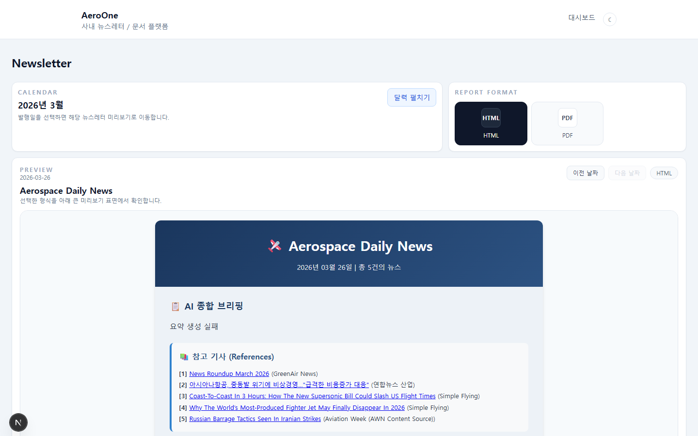
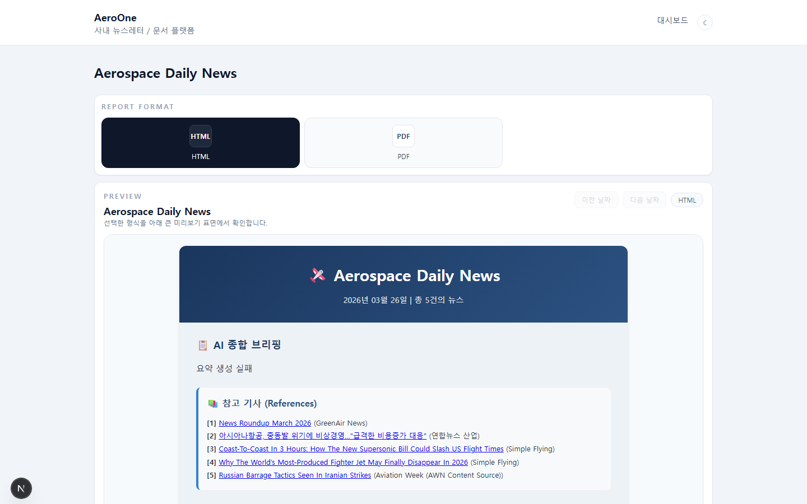
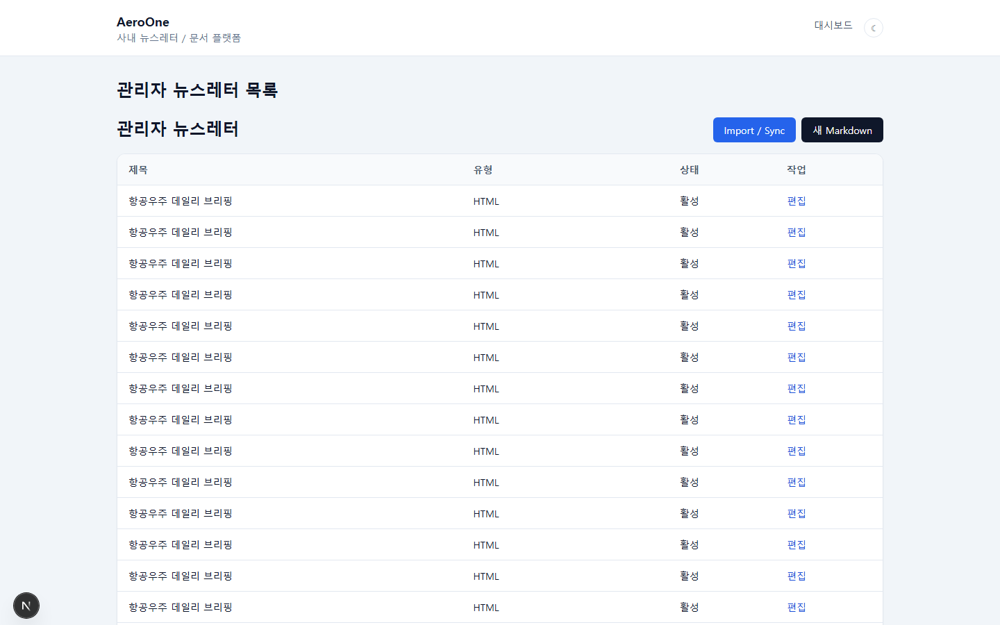

<div align="center">

# AeroOne

**폐쇄망에서도 그대로 돌아가는 사내 뉴스레터·문서 열람 플랫폼**

이미 발행된 HTML / PDF / Markdown 뉴스레터를 한 곳에서 보고, ZIP 하나로 인터넷이 차단된 PC에 동일하게 배포할 수 있는 modular monolith 입니다.


</div>

<table>
  <tr>
    <td align="center"><b>공개 목록 / 달력</b></td>
    <td align="center"><b>미리보기 (HTML / PDF / Markdown)</b></td>
    <td align="center"><b>관리자 페이지</b></td>
  </tr>
  <tr>
    <td></td>
    <td></td>
    <td></td>
  </tr>
</table>

<sub>스크린샷이 아직 비어 있다면 <code>docs/images/</code> 에 <code>list.png</code> · <code>preview.png</code> · <code>admin.png</code> 를 추가하면 자동으로 렌더링됩니다.</sub>

---

## 목차

- [왜 AeroOne 인가](#왜-aeroone-인가)
- [주요 기능](#주요-기능)
- [빠른 시작 — 온라인 Windows PC](#빠른-시작--온라인-windows-pc)
- [폐쇄망 배포 흐름](#폐쇄망-배포-흐름)
- [기술 스택](#기술-스택)
- [프로젝트 구조](#프로젝트-구조)
- [환경 변수](#환경-변수)
- [개발자용 로컬 실행](#개발자용-로컬-실행)
- [검증](#검증)
- [보안과 운영 권장사항](#보안과-운영-권장사항)
- [문서](#문서)
- [사용 범위와 기여](#사용-범위와-기여)

---

## 왜 AeroOne 인가

- **폐쇄망 우선 설계** — 인터넷이 가능한 PC에서 ZIP 한 개를 만들어 옮기면, 폐쇄망 PC에서 같은 코드·같은 의존성·같은 시드 데이터로 그대로 동작합니다. wheelhouse, `node_modules`, 옵션 인스톨러까지 묶여 있습니다.
- **다중 포맷 통합 뷰어** — `newsletter_YYYYMMDD.html` 과 `Aerospace Daily News_YYYYMMDD.pdf` 처럼 한 이슈가 여러 자산을 가지는 현실 데이터를 그대로 다룹니다. `source_type` 에 따라 sandbox iframe / PDF delivery / Markdown render 로 분기합니다.
- **안전한 기본값** — production 환경에서는 기본 secret 과 admin 비밀번호가 거부되고, setup 시 매번 랜덤 값이 생성됩니다. 정적 노출 범위는 `storage/thumbnails` 하위로 한정하고, `_debug.html` 은 import 와 공개 목록에서 모두 제외됩니다.
- **확장 가능한 구조** — 뉴스레터 외 announcement, schedule, document publishing, admin tools 등 사내 모듈을 같은 저장소 안에서 modular monolith 로 붙일 수 있도록 설계했습니다.

---

## 주요 기능

| 영역 | 내용 |
|---|---|
| 사용자 화면 | 뉴스레터 목록, 달력 네비게이션(기본 접힘), 검색·태그·카테고리 필터, 미리보기와 이전/다음 이동, 테마 토글 |
| 콘텐츠 분기 | HTML(sandbox iframe + sanitize + CSP), PDF(direct delivery), Markdown(서버 렌더) |
| 관리자 화면 | 로그인, 메타데이터 CRUD, 카테고리·태그 관리, 썸네일 업로드, `Newsletter/output` import / sync |
| 인증 | signed HttpOnly session cookie + SameSite=Lax + CSRF 토큰, 단일 시드 관리자 |
| 데이터 모델 | `users / categories / tags / newsletters / newsletter_tags / newsletter_assets` 로 다중 자산 페어링 |
| 검증 | backend pytest + httpx, frontend Vitest + Testing Library, Windows 실행 스모크 |
| 배포 | Docker Compose (개발), Windows 배치 스크립트 (운영/폐쇄망) |

---

## 빠른 시작 — 온라인 Windows PC

```cmd
:: 1) 초기 설치 (가상환경, 의존성, DB, 시드, frontend npm install)
setup.bat

:: 2) 백엔드/프런트 실행 + 브라우저 자동 오픈
start.bat
```

| 화면 | URL |
|---|---|
| 공개 목록 | http://localhost:29501/newsletters |
| 관리자 로그인 | http://localhost:29501/login |
| 헬스체크 | http://localhost:18437/api/v1/health |

관리자 계정은 `setup.bat` 이 매번 랜덤 비밀번호로 생성합니다. 설치 직후에는 `backend/.env` 의 `ADMIN_USERNAME` / `ADMIN_PASSWORD` 를 확인하세요.

추가 옵션:

```cmd
setup.bat --dry-run     :: 실제 설치 없이 단계만 출력
setup.bat --no-pause    :: 완료 후 창을 멈추지 않음
```

---

## 폐쇄망 배포 흐름

```
[온라인 PC]                              [폐쇄망 PC]
 setup.bat                               ─┐
 start.bat (선택, 동작 검증)               │
 offline_package.bat ───── ZIP ─────►    setup_offline.bat
                                          start_offline.bat
```

1. **온라인 PC**

   ```cmd
   setup.bat
   start.bat            :: 동작 확인 후 닫기
   offline_package.bat  :: dist\AeroOne-offline-YYYYMMDD-HHMMSS.zip 생성
   ```

   ZIP 안에 들어가는 것:

   - 저장소 소스 (`.git`, `.venv`, `node_modules`, `dist`, `backend/data` 등은 제외)
   - `frontend/node_modules` (오프라인용 별도 복사본)
   - Python wheelhouse (`offline_assets/python-wheels/`)
   - 선택적으로 `offline_installers/` 에 미리 둔 Python·Node 설치파일 → `offline_assets/installers/`

2. **폐쇄망 PC**

   ```cmd
   setup_offline.bat    :: .env 재작성, 가상환경, 오프라인 pip install, DB, build
   start_offline.bat    :: 백엔드/프런트 실행 + 브라우저 자동 오픈
   ```

   `setup_offline.bat` 는 폐쇄망 PC에서도 `JWT_SECRET_KEY` 와 `ADMIN_PASSWORD` 를 새 랜덤 값으로 다시 생성하고, 기존 `.env` 는 `.bak` 로 자동 백업합니다.

자세한 절차와 FAQ: [`docs/runbook/windows-offline.md`](docs/runbook/windows-offline.md)

---

## 기술 스택

| 계층 | 사용 기술 |
|---|---|
| Frontend | Next.js (App Router), TypeScript, Tailwind CSS |
| Backend | FastAPI, Pydantic, SQLAlchemy 2.x, Alembic |
| Auth | signed HttpOnly session cookie, CSRF 토큰 |
| Data | SQLite (운영 시작점) → PostgreSQL 전환 가능 |
| Storage | 로컬 파일시스템 + `StorageService` 추상화 (MinIO/S3 전환 여지) |
| Test | pytest, pytest-asyncio, httpx / Vitest, Testing Library |
| Infra | Docker Compose, Windows 배치 스크립트 |

---

## 프로젝트 구조

```
AeroOne/
├─ backend/              FastAPI 앱, Alembic 마이그레이션, 시드 스크립트
├─ frontend/             Next.js 앱
├─ Newsletter/output/    실데이터 HTML/PDF 원본 (import root)
├─ storage/              Markdown / 썸네일 / 첨부 (앱 관리)
├─ docs/                 개발 계획, 런북, 설계 문서
├─ infra/                Dockerfile / compose 자원
├─ scripts/              런처 보조 스크립트 (브라우저 오픈 등)
├─ setup.bat             온라인 PC 초기 설치
├─ start.bat             온라인 PC 실행
├─ offline_package.bat   폐쇄망용 ZIP 패키지 생성
├─ setup_offline.bat     폐쇄망 PC 초기 설치
├─ start_offline.bat     폐쇄망 PC 실행
└─ docker-compose.yml    개발용 컨테이너 실행
```

---

## 환경 변수

기본값과 의미만 발췌했습니다. 전체 키는 [`.env.example`](.env.example) 참고.

| 키 | 의미 | 기본값 / 비고 |
|---|---|---|
| `APP_ENV` | 실행 모드 | `development` / `production` (production 은 기본 secret 거부) |
| `BACKEND_PORT` / `FRONTEND_PORT` | 서비스 포트 | `18437` / `29501` |
| `DATABASE_URL` | DB 연결 문자열 | SQLite 기본, PostgreSQL 가능 |
| `JWT_SECRET_KEY` | 세션 서명 키 | setup 시 랜덤 생성 |
| `ADMIN_USERNAME` / `ADMIN_PASSWORD` | 단일 시드 관리자 | setup 시 비밀번호 랜덤 생성 |
| `ADMIN_SESSION_COOKIE_NAME` | 관리자 세션 쿠키 이름 | `admin_session` |
| `CSRF_COOKIE_NAME` | CSRF 토큰 쿠키 이름 | 프런트와 동일 값 사용 |
| `NEWSLETTER_IMPORT_ROOT_HOST` / `_CONTAINER` | 원본 폴더 호스트/컨테이너 경로 | 컨테이너 실행 시 양쪽 사용 |
| `STORAGE_ROOT` | 앱 storage 루트 | 정적 노출은 `thumbnails` 하위만 |
| `CORS_ORIGINS` | 프런트 origin 화이트리스트 | `http://localhost:29501` |

---

## 개발자용 로컬 실행

Linux / macOS / WSL:

```bash
cp .env.example .env

cd backend
python3 -m venv .venv
. .venv/bin/activate
pip install -r requirements-dev.txt
alembic upgrade head
PYTHONPATH=. python scripts/seed.py
uvicorn app.main:app --reload --host 0.0.0.0 --port 18437

# 다른 터미널
cd frontend
npm install
npm run dev
```

Docker:

```bash
docker compose up --build
```

`git worktree` 환경에서 `.venv` / `node_modules` / `backend/data` / `Newsletter/output` 가 비어 보이는 케이스 등 운영자 주의사항은 [`docs/runbook/local-dev.md`](docs/runbook/local-dev.md) 에 정리되어 있습니다.

---

## 검증

```bash
# backend
cd backend && . .venv/bin/activate
python -m pytest

# frontend
cd frontend
npm run test
npm run typecheck
npm run build
```

릴리스 1.0.1 기준 모두 통과 상태입니다.

---

## 보안과 운영 권장사항

- production 배포 시 `.env` 의 `APP_ENV=production` 으로 설정 → 기본 secret 과 admin 비밀번호가 즉시 거부됩니다.
- HTTPS 종단을 두면 `secure cookie` 가 자동으로 활성화됩니다.
- `Newsletter/output` 와 `storage/` 는 운영 PC에 한정해 두고, 백업·접근 권한은 사내 정책에 맞춰 분리하세요.
- 관리자 비밀번호 노출이 의심되면 `setup.bat` 또는 `setup_offline.bat` 을 다시 실행하세요. 새 랜덤 값으로 교체되며 기존 `.env` 는 `.bak` 로 자동 백업됩니다.
- 관리자 인증은 `/admin/*` 모든 mutation/sync 엔드포인트의 신뢰 경계입니다. 정책 배경: [`docs/runbook/admin-auth.md`](docs/runbook/admin-auth.md)

---

## 문서

| 분류 | 위치 |
|---|---|
| 개발 계획 | [`docs/dev_plan/20260327_newsletter_platform_mvp.md`](docs/dev_plan/20260327_newsletter_platform_mvp.md) |
| PRD | [`.omx/plans/prd-newsletter-platform-mvp.md`](.omx/plans/prd-newsletter-platform-mvp.md) |
| 테스트 명세 | [`.omx/plans/test-spec-newsletter-platform-mvp.md`](.omx/plans/test-spec-newsletter-platform-mvp.md) |
| 로컬 개발 런북 | [`docs/runbook/local-dev.md`](docs/runbook/local-dev.md) |
| 폐쇄망 실행 런북 | [`docs/runbook/windows-offline.md`](docs/runbook/windows-offline.md) |
| 관리자 인증 정책 | [`docs/runbook/admin-auth.md`](docs/runbook/admin-auth.md) |
| 설계 산출물 | [`docs/superpowers/specs/`](docs/superpowers/specs/), [`docs/superpowers/plans/`](docs/superpowers/plans/) |

---

## 사용 범위와 기여

- AeroOne 은 사내 폐쇄망 운영을 일차 목적으로 하는 운영 소프트웨어입니다. 외부 환경에 그대로 노출하기 전에는 최소한 다음을 점검하세요.
  - `APP_ENV=production` 강제와 secret/비밀번호 정책
  - HTTPS 종단과 `secure cookie` 보장
  - `Newsletter/output` 와 `storage/` 의 접근 권한
  - CORS / 리버스 프록시 / 방화벽 구성
- 커밋 메시지는 한국어 제목 + 한국어 본문 + Lore trailer 규칙을 따릅니다. 자세한 규칙: [`AGENTS.md`](AGENTS.md), [`CLAUDE.md`](CLAUDE.md).
- 외부 PR / 이슈 / 라이선스 정책이 필요한 경우 별도 문서로 추가하세요. 현재 저장소에는 라이선스 파일이 포함되어 있지 않습니다.
